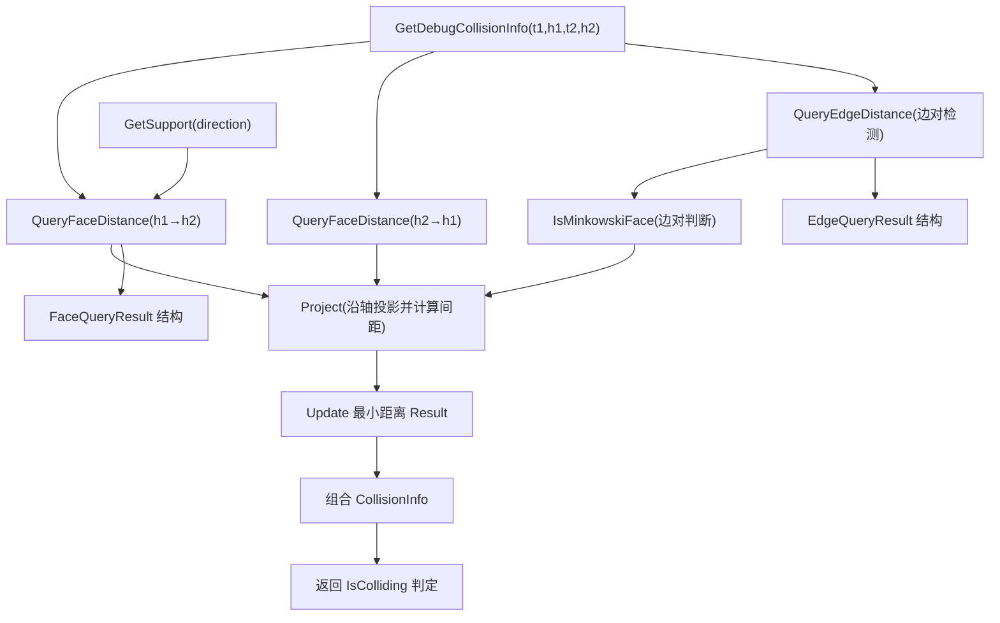

# HullCollision — 分离轴与边对检测（SAT + Edge tests）

> 本笔记讲解 `HullCollision` 的核心流程与关键函数，适合用于理解碰撞判定逻辑（面距离、边对投影、Minkowski 面判断与最终接触判定）。

---

## 交互式流程图（Mermaid + click）

### GetDebugCollisionInfo

`GetDebugCollisionInfo(RigidTransform t1, NativeHull h1, RigidTransform t2, NativeHull h2)` — 主入口，执行整体碰撞检测并返回调试信息。

**步骤：**

1. 调用 `QueryFaceDistance(h1→h2)` 获取从 h1 面方向看到的最小间距（FaceQueryResult）。
    
2. 调用 `QueryFaceDistance(h2→h1)` 获取反方向的最小间距。
    
3. 调用 `QueryEdgeDistance()` 检查边对产生的潜在分离轴（EdgeQueryResult）。
    
4. 比较所有候选轴的距离，更新最小距离并记录是哪一种轴（面/边）。
    
5. 组合出 `CollisionInfo`（包含 FaceIndex、EdgeIndex、Distance 等），并据此判断 `IsColliding`（若无分离轴，视为相交）。
    

**学习要点：**

- 这是 SAT（Separating Axis Theorem）在凸多面体上的实现：检查所有可能的分离轴（面法线和边对生成的轴）；若任一轴存在正距离（分离），则不碰撞。
    

---

### QueryFaceDistance

`QueryFaceDistance(out FaceQueryResult result, RigidTransform t1, NativeHull h1, RigidTransform t2, NativeHull h2)`

**逻辑：**

- 遍历 `h1` 的每个面 i：
    
    - 把面平面从局部空间转换到目标参考空间（`transform = inv(t2) * t1` 或按实现变换）。
        
    - 获取 `plane`，计算在该平面法线方向上 `h2` 的支持点：`support = hull2.GetSupport(-plane.Normal)`。
        
    - 计算 `distance = plane.Distance(support)`（点到平面的距离）。
        
    - 若 `distance` 比当前结果大则更新（记录 face index、distance、support point 信息）。
        
- 返回能分离的最大距离（若 > 0，则说明存在分离轴）。
    

**数据结构：** `FaceQueryResult` 包含 `Index`、`Distance`、`LocalSupport` 等信息（可在源码中查看具体字段）。

**要点：**

- 面法线只是候选轴之一；在很多情况下（例如凸多面体平面对齐）面法线就能判定是否分离。
    
- 要注意变换（空间）的一致性：plane 与 support 必须在同一空间下计算 dot/distance。
    

---

### QueryEdgeDistance

`QueryEdgeDistance(out EdgeQueryResult result, RigidTransform t1, NativeHull h1, RigidTransform t2, NativeHull h2)`

**作用：**

- 遍历 `h1` 的每条边（半边对），和 `h2` 的每条边，尝试找出边对组合是否能产生有效分离轴（通过边向量的叉乘产生轴）。
    
- 对每对边：
    
    - 获取边向量 `E1`（h1）与 `E2`（h2），并取两面的平面法线 `U1, V1, U2, V2`（作为边周围面法线）。
        
    - 先调用 `IsMinkowskiFace(U1, V1, -E1, -U2, -V2, -E2)` 或等价判断，判断该边对是否能构成 Minkowski 面（即是否是有效候选轴）。
        
    - 若满足，计算候选轴 `axis = normalize(cross(E1, E2))`，再 `Project` 两个凸包到该轴上计算分离距离。
        
    - 若 `distance` 更大，更新 `EdgeQueryResult`（记录边索引、距离、接触点等）。
        
- 返回 `EdgeQueryResult`（包含 Index1、Index2、Distance 等）。
    

**注意：**

- 由于边对数量可能很多（E1_count * E2_count），实现中通常步长为 2（因为半边列表里每对边为双条半边），并加入早期终止和过滤来减少计算量。
    
- `IsMinkowskiFace` 用于过滤掉不合格的边对，避免不必要的投影计算。
    

---

### IsMinkowskiFace

`IsMinkowskiFace(U1, V1, E1, U2, V2, E2)` — 判断两条边（连同其相邻面法线）是否构成 Minkowski 面（即它们在 Minkowski 差空间的贡献面是否为支持表面），常见实现逻辑：

- 核心思想：两条边能生成有效分离轴的充要条件包括相邻面的法线方向关系满足一定的“向外”/“向内”比较（具体见源码的符号判断）。
    
- 函数通常会通过一系列点积与方向比较判断边对是否构成在两个凸体接触处的特征对（feature pair）。
    

**理解层面：**

- IsMinkowskiFace 是一个过滤器，避免对大量无效边对做昂贵的投影计算。
    

---

### Project

`Project(NativeHull a, NativeHull b, float3 axis, out float distance, out FeaturePair pair)` — 将两个凸包投影到 `axis` 上并计算它们沿该轴的最小间距/穿透。

**步骤：**

1. 对每个 hull 通过 `GetSupport(axis)` 找到支持点（最远点）或通过 `GetSupportIndex` 找到支持顶点索引。
    
2. 在 axis 上计算两个支持点的投影差值，得到 `distance`（如果为正则为分离距离，为负则为穿透深度）。
    
3. 填充 `FeaturePair` / `EdgeQueryResult` 中的特征信息（用于后续的接触点构建）。
    

**要点：**

- `GetSupport` 的实现是遍历顶点求最大 `dot(axis, vertex)`；在大型 hull 上可用加速结构，但此实现为线性时间。
    
- Project 是 SAT 的核心：所有候选轴上都执行此计算以寻找最大分离距离（若找到正距离 → 分离）。
    

---

### GetSupport

`NativeHull.GetSupport(float3 direction)` — 返回在给定方向上支持顶点（支持点位置）。

**实现：**

- 遍历 `hull.Vertices` ，计算 `dot(direction, vertex)`，找最大值对应的顶点并返回。
    

**优化思路：**

- 对于静态 hull，可预计算包围方向索引表（支持结构）；对于动态 hull，需权衡构建索引的成本。
    
- 在多数实现中，`GetSupportIndex` 返回索引，`GetSupport` 返回顶点位置。
    

---

## 常见问题与调试建议

- **click 无效**：先用「复制内部链接（Copy internal link）」得到精确 fragment 替换 `click` 中的 `#...`；若仍无效，使用下方 Wiki 链接跳转。
    
- **边对数量太多导致性能问题**：可在 `QueryEdgeDistance` 中加入早期退出（当当前最小距离小于某阈值），或对边对进行方向/角度预过滤。
    
- **坐标空间不一致导致距离计算错误**：务必保证 plane 与 support 在同一坐标空间下计算（一般把 plane 变换到对方空间或把 support 变换到 plane 空间）。
    
- **数值稳定性**：对法线与轴做归一化并对极小长度轴做跳过处理（避免除零或数值误差）。