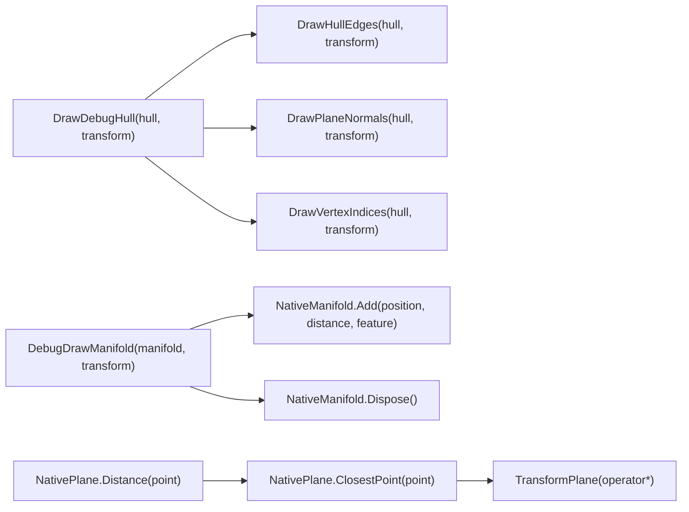

# 模块 7 — HullDrawingUtility / NativeManifold / NativePlane（绘制、接触集、平面运算）

> 本笔记包含绘制辅助、接触点集合（NativeManifold）与平面运算（NativePlane）的详细说明、示例与调试建议。
> 适合在阅读源码与调试时作为快速参考。

---

## 流程图

## DrawDebugHull

**Heading:** `DrawDebugHull`

**用途**  
在 Scene 视图或运行环境中绘制 `NativeHull` 的拓扑（边、顶点、法线、索引），方便观察顶点顺序、半边拓扑和法线方向。

**常见签名（伪）**

`public static void DrawDebugHull(NativeHull hull, RigidTransform t, bool drawIndices = true, bool drawNormals = false)`

**实现要点**

- 遍历 `hull.Edges`（步长通常为 2 或按 face 遍历避免重复），取出 `Origin` 与对应顶点坐标；
    
- 将局部顶点通过 `math.transform(t, localVertex)` 转到世界空间后绘制（`Debug.DrawLine` / `Gizmos.DrawLine`）；
    
- 根据需要绘制法线：取 `hull.GetPlane(faceIndex).Normal`，在面质心处绘制箭头（起点 = centroid，终点 = centroid + normal * scale）；
    
- 绘制顶点索引（`Handles.Label` / `Handles.DrawWireDisc` 在编辑器内，或用小文本的 Gizmo 替代）。
    

**绘制函数选择**

- 编辑器内（Editor scripts）推荐使用 `Handles` 与 `Gizmos` 可视化（更丰富的文本/标签）；
    
- 运行时或简单调试用 `Debug.DrawLine` / `Debug.DrawRay`（不需要 Editor API）
## DrawHullEdges / DrawPlaneNormals / DrawVertexIndices

**Heading:** `DrawHullEdges / DrawPlaneNormals / DrawVertexIndices`

- `DrawHullEdges`：只画边线，颜色可按面/边类别区分（碰撞检测高亮）。
    
- `DrawPlaneNormals`：画面法线向量，位置通常在 face centroid 或每边中点。
    
- `DrawVertexIndices`：在每个顶点处画文本（或小圆点）显示索引，便于在错误拓扑时定位问题。
    

**注意**

- 在大型 Hull 上大量绘制文字会影响性能，建议只在调试少量对象时开启索引绘制。
    
- 对于动态频繁更新的场景，避免在每帧都创建大量临时对象（字符串），可以缓存标签或用更轻量的圆点/线表示。
    

---

## DebugDrawManifold

**Heading:** `DebugDrawManifold`

**用途**  
把 `NativeManifold` 中的接触点、法线与深度可视化，帮助验证接触点是否合理（位置、穿透深度、法线方向等）。

**实现要点**

- 遍历 `manifold[i]`：绘制小球（`Debug.DrawLine` 圆环或 `Gizmos.DrawSphere`）表示接触点位置；
    
- 绘制法线箭头：从 `point.Position` 向 `point.Position + manifold.Normal * scale`；若 manifold 中各点有各自法线，亦可绘制每点法线；
    
- 绘制 feature label（若 `ContactID` 有meaningful fields），例如 “v:12 / e:34” 文本（编辑器中用 `Handles.Label`）。
    
- 可选择绘制点到另一个 hull 的最近点连线（用于检查最短距离方向是否与法线一致）。
    

**提示**

- 确认使用的空间（manifold points 是否在 world-space），若不是需要做变换；
    
- 若 manifold 为 `Allocator.Persistent` 分配，绘制结束后仍需在合适位置 `Dispose`。
    

---

## NativeManifold（结构与用法）

**Heading:** `NativeManifold_Add_Dispose`

**Add(position, distance, id)**

- 检查当前 `Length < MaxPoints`，若达到上限则忽略或替换最浅的点（策略由实现决定）；
    
- 使用 `NativeArray.Set` 或 `UnsafeUtility.CopyStructureToPtr` 等方法写入内存（无托管分配）。
    

**Dispose()**

- 释放内部 NativeArray，设置指针/长度为 0，避免悬空访问；
    
- 典型实现：
    

`if (_points.IsCreated) _points.Dispose(); _length = 0;`

**迭代 / 读取**

- 实现索引器 `manifold[i]` 返回 `ContactPoint`（值复制或指针读取），用于遍历绘制或物理使用。
    

**内存分配建议**

- 在频繁调用场景下建议**复用** NativeManifold（对象池）或在外部分配并传入 Burst job（避免 Burst 内分配 Persistent）；
    
- `Allocator.TempJob` 可用于短期 job（确保 job 执行完即释放），`Allocator.Persistent` 用于跨帧保存但需手动释放。
    

**合并 / 去重策略**

- 在 Add 前检查是否已有接近点（distance between positions < eps），如果是则合并（保留距离更大或 feature 更明确的点）；
    
- 对于超过 MaxPoints 的情况，常按 penetration depth 排序保留最显著的点。
    

---

## NativePlane（距离、最近点、变换）

**Distance(point)**

- 返回标量 `dot(N, p) - Offset`。若 > 0 表示点在法线“外侧”（按约定），若 < 0 在内侧。
    
- 使用 `eps` 进行数值比较（例如 `Distance > 1e-6` 判为外部）。
    

**ClosestPoint(point)**

- 计算点到平面的垂线投影，返回投影点；常用于裁剪交点插值或生成接触点在面上的投影。
    

**Plane 变换 operator***

- 常见实现 `static NativePlane operator*(RigidTransform t, NativePlane p)`：
    
    - `normal' = mul(t.rot, p.Normal)`；
        
    - `offset' = p.Offset + dot(normal', t.pos)` 或按正确变换公式调整偏移；
        
- 注意旋转与位移顺序，确保变换后 Plane 在目标空间仍满足 `dot(N', x) - offset' = 0` 对原来平面的点 x 成立（具体实现需参考项目中的变换约定）。
    
