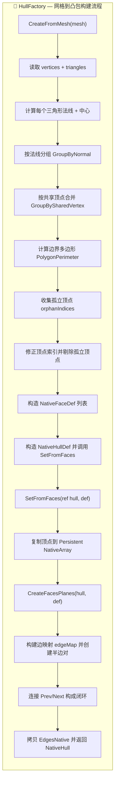

HullFactory — 凸包工厂类，用于创建各种类型的凸包
---
## 概览
`HullFactory` 的职责是：**把 Unity 的 Mesh（三角形网格）转换成可用于碰撞检测的 `NativeHull`**。  
核心步骤包括：
- 读取 Mesh 的顶点与三角形索引；
- 计算每个三角形的法线与中心；
- 将共面的三角形按法线与共享顶点合并成更大的面；
- 计算面边界（Polygon Perimeter），剔除孤立顶点；
- 构建半边（Half-Edge）拓扑：Edge / Twin / Prev / Next / Face；
- 生成面平面（NativePlane）用于 SAT 与裁剪算法。

---

## 流程图

### CreateFromMesh

`CreateFromMesh(Mesh mesh)` — 从 Mesh 生成 `NativeHull` 的主入口。

**步骤要点**：

- 读取 `mesh.vertices`（对坐标做舍入 `RoundVertex`）与 `mesh.triangles`；
    
- 对每个三角形计算法线与中心（并对法线舍入），把三角形封装为 `DetailedFaceDef`；
    
- 使用 `GroupByNormal` → `GroupBySharedVertex` 合并共面并相邻的三角形；
    
- 对每组合并面调用 `PolygonPerimeter.CalculatePerimeter` 取得边界序列；
    
- 标记孤立顶点并从 `uniqueVerts` 中删除，修正索引；
    
- 构造 `NativeFaceDef` 列表与 `NativeHullDef`，调用 `SetFromFaces` 构建半边结构。
    

---

### SetFromFaces

`SetFromFaces(ref NativeHull hull, NativeHullDef def)` — 将面定义转为 `NativeHull`（半边拓扑）。

**关键步骤**：

1. 验证 `def.FaceCount` 与 `def.VertexCount`；
    
2. 复制顶点到 `Persistent NativeArray` 并保存指针；
    
3. 初始化 `hull.FacesNative` 并把每个 `NativeFace.Edge = -1`；
    
4. 调用 `CreateFacesPlanes` 生成每面平面信息（法线与 Offset）；
    
5. 遍历每个面与其边，使用 `edgeMap`（(v1,v2) -> edgeIndex）匹配或创建半边对（e12/e21）；
    
6. 连接每个面的半边 `Prev/Next` 成环；
    
7. 把临时 `edgesList` 拷贝到 `hull.EdgesNative` 并设置 `hull.Edges` 指针。
    

**注意**：确保在创建边对时正确设置 `Twin`、`Face`、`Origin`，否则拓扑会不一致。

---

### CreateFacesPlanes

`CreateFacesPlanes(ref NativeHull hull, ref NativeHullDef def)` — 为每个面生成 `NativePlane`（法线 + 偏移）。

**实现要点**：

- 使用 **Newell 方法** 计算任意多边形面法线，更稳健（适用于非三角形面）；
    
- 计算质心 `centroid` = 顶点平均值，偏移 `Offset = dot(normal, centroid)`；
    
- 将归一化后的法线与偏移写入 `hull.Planes`。
    

---

### GroupByNormal

`GroupByNormal(IList<DetailedFaceDef> data)` — 将三角形按舍入后的法线（float3）分组以减少浮点误差导致的分裂。

**提示**：`RoundVertex` 对法线做舍入（例如保留小数点后 3 位）可以显著提升分组稳定性。

---

### GroupBySharedVertex

`GroupBySharedVertex(Dictionary<float3, List<DetailedFaceDef>> groupedFaces)` — 在同一法线组内按共享顶点合并连通三角形。

**核心思想**：对同一法线组内的每个三角形，如果它与已有组的顶点集合有交集就加入该组；否则新建组。结果是连通的、共面的面块集合。

---

### PolygonPerimeter（说明）

`PolygonPerimeter.CalculatePerimeter(indices)` — 从一堆顶点索引中计算边界顶点序列（环形有序边界）。

**用途**：

- 输入可能包含内点或重复索引，输出为边界顺序索引（顺时针或逆时针）；
    
- 输出用于构建 `NativeFaceDef.Vertices` 的顺序数组（非常重要）。