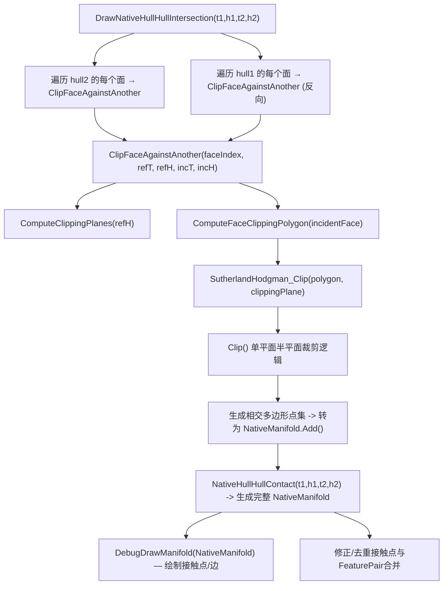
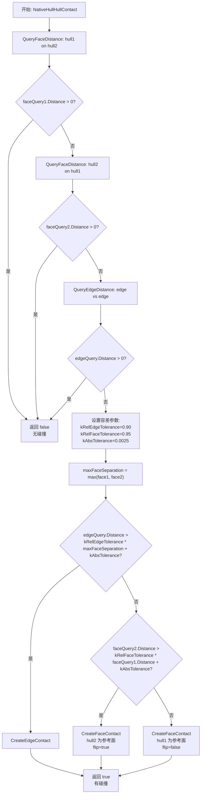

# HullIntersection — 面裁剪、相交区域与接触点构建（Sutherland-Hodgman / Manifold）

> 本笔记讲解 `HullIntersection` 模块的主流程、面裁剪（Sutherland-Hodgman）、相交多边形构造与 `NativeManifold` 的生成逻辑，适合用于理解接触点构建与相交区域可视化。

---

## 流程图

### DrawNativeHullHullIntersection

**作用**

- 主入口：对两个 `NativeHull` 的每一面尝试执行裁剪，收集相交多边形并聚合为接触点集合（`NativeManifold`）；并调用绘制函数显示交点/法线/多边形。
    

**要点**

- 对两个方向都进行裁剪（h2 的面裁剪 h1 与 h1 的面裁剪 h2），避免遗漏边／点特征；
    
- 裁剪产生的多边形可能是空集、单点、线段或多顶点多边形；都需统一处理到接触点集合。

---

### ClipFace

**逻辑**

1. 将凸包面变换到世界空间坐标系。

2. 获取与h2中与h1最相对的那个面`ComputeIncidentFaceIndex(plane, transform2, hull2)`。

3. 执行实际裁剪工作。

---

### ClipFaceAgainstAnother

**逻辑**

1. 获取 `refPlane`（参考面的 `NativePlane`）。
    
2. 获取 `clippingPlanes`：`GetClippingPlanes(incHull)`（即 incHull 的所有平面在 ref 空间下）。
    
3. 获取 `incidentPolygon`：取 `incHull` 上 `faceIdx_inc` 对应的多边形顶点（world 或 ref 空间）。
    
4. 逐个 `Clip(incidentPolygon, plane)`（Sutherland-Hodgman），更新 polygon。
    
5. 返回最终 polygon（可能为空）。
    

**注意**

- 变换一致性：要确保 `incidentPolygon` 与 `clippingPlanes` 在同一空间（通常把 inc 面点变换到 ref 面空间或把裁剪平面变换到 incident 空间）。
    
- 裁剪顺序通常随面集合顺序；若需更稳定可按平面朝向或距离排序。
    

---

### GetClippingPlanes

**作用**

- 返回用于裁剪的平面集合（通常来自 `refHull` 的若干相邻面或全部平面，视实现而定）。
    

**实现细节**

- 对 `refHull`，取出所有 `NativePlane`，或只取与参考 face 相邻的面（可减少裁剪数）。
    
- 把平面用刚体变换转换到 incident polygon 所在空间（或反之）。
    
- 可以过滤掉朝内/朝外的平面以减少冗余裁剪（例如只保留面法线朝外的平面作为 clipping planes）。
    

**性能提示**

- 如果每面都用所有其他面的平面裁剪，复杂度高但能保证正确性；为性能可只用相邻面或与参考面法线夹角小于阈值的平面。
    

---

### ComputeFaceClippingPolygon

**作用**

- 把 `incidentFace`（incHull 某一面）的顶点序列取出，并转到裁剪所需空间，得到初始 polygon（顶点序列），作为 Sutherland-Hodgman 的输入。
    

**注意**

- Ensure polygon vertex order is consistent (clockwise/ccw) — Newell / HullFactory 中已确定顺序，若顺序反了，裁剪依旧工作但法向与朝向判断要一致。
    
- 若 polygon 顶点包含重复或共线点，可先做预处理（去重、合并近邻顶点）以提高数值稳定性。
    

---

### Clip（Sutherland-Hodgman）

**数值注意**

- `eps`（如 1e-6）用来判断点在平面“内侧”还是“外侧”，避免因浮点误差丢掉接触点。
    
- 插值位置 `t` 要限制在 [0,1] 并处理除零（当 d1≈d2≈0）。
    
- 处理退化情况：输入为点或线段时，Clip 需要兼容并返回合理结果（0、1 或 2 个点）。
    

---

### ComputeContactPoints

**作用**

- 从裁剪得到的多边形（在参考面空间或世界空间）选取用于 `NativeManifold` 的接触点集合，通常：
    
    - 若多边形为顶点集合：把每个顶点转成 ContactPoint（Position、Distance、FeaturePair）；
        
    - 若多边形为线段：用线段端点与中点作为接触点；
        
    - 对于多边形可做顶点合并（合并非常接近的点）以避免重复点。
        

**特征信息**

- ContactPoint 除位置外，还需包含 `ContactID`（`FeaturePair`）来标识两个形状之间参与接触的特征（面/边/点索引），以便后续的物理或回放使用。
    

**过滤与合并**

- 使用最小距离阈值合并近邻点（例如如果两个点距离 < 1e-4，则只保留一个并更新特征）。
    
- 对于大量点，用面积或凸壳简化以保持 manifold 点数在合理范围（NativeManifold.MaxPoints = 24）。
    

---

### BuildManifold

**作用**

- 把所有收集到的 ContactPoint 进行去重、排序与最终写入 `NativeManifold` 结构：
    
    - 去重（基于位置与 FeaturePair）；
        
    - 限制最大点数（保留代表性点，例如按照 penetration depth 或分布选择）；
        
    - 计算 `manifold.Normal`（通常用参考面法线的平均或加权平均）。
        

**实用策略**

- 优先保留穿透深度（penetration）更大的点与空间分布更均匀的点；
    
- 如果需要确定稳定顺序以便回放，可按 `FeaturePair` + `Position` 进行排序。
    

---

### DebugDrawManifold

**作用**

- 在 Scene/Editor 中绘制 manifold 的信息：点（球体）、法线（箭头）、连线（多边形边）以及 FeaturePair 标注（文本），方便调试。
    

**建议**

- 给不同来源的点（来自 h1 或 h2）使用不同颜色；
    
- 绘制投影到参考面的点与原始世界点，便于定位坐标系错误；
    
- 在复杂场景中提供开关（只在选中物体时绘制或限制数量）。
---
### NativeHullHullContact
**作用**
- 用于得到碰撞具体信息
**流程**
