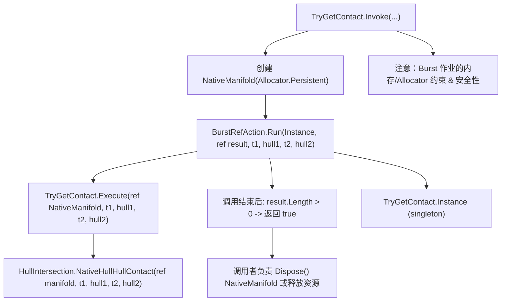

# HullOperations — Burst 封装与接触点计算（Module 5）

> 本笔记讲解 `HullOperations` 模块：主要提供对碰撞接触计算的 Burst 封装入口（TryGetContact 等），以及与 `NativeManifold` 生命周期、安全分配、调用约定相关的注意事项与示例。

---

## 概览
`HullOperations` 将性能关键的接触计算封装为可以以 Burst/JIT 友好方式调用的动作（例如 `TryGetContact`）。主要职责包括：

- 提供 `TryGetContact` 结构体（实现 `IBurstRefAction<...>`），在 Burst 环境中执行 `HullIntersection.NativeHullHullContact` 等耗时操作；  
- 提供静态 `Invoke` 方法做调用封装（在主线程/非 Burst 环境中创建 `NativeManifold`，再通过 Burst runner 调用 Execute）；  
- 处理 `NativeManifold` 的分配（Allocator）、返回判定与内存释放注意事项。

---

## 流程图

## TryGetContact_Invoke

**Heading:** `TryGetContact_Invoke`

**说明（功能）**  
静态封装入口，用于从托管/主线程调用 Burst 优化的接触计算：

- 在调用处先创建 `NativeManifold result = new NativeManifold(Allocator.Persistent);`（或其它合适的 allocator）；
    
- 调用 `BurstRefAction<TryGetContact, ...>.Run(Instance, ref result, t1, hull1, t2, hull2);` 将执行 `TryGetContact.Execute`（在 Burst 上下文或通过适配器执行）；
    
- 最后用 `return result.Length > 0;` 判断是否产生接触（注意：`result` 仍然持有内存，需要调用方在合适的时机 `Dispose()`）。
    

**注意点**

- `Allocator.Persistent` 意味着分配的内存必须由调用者负责释放（`result.Dispose()`）；
    
- 如果你调用此函数多次或在循环里使用，注意不要泄漏内存（每个 Persistent 分配都要释放）；
    
- 如果希望更短生命周期，可替换为 `Allocator.TempJob`，但要确认 Burst 任务执行时机和调度方式允许这样做。
    

---

## TryGetContact_Execute

**Heading:** `TryGetContact_Execute`

**说明（功能）**  
`Execute` 是 `IBurstRefAction<...>` 的实现体，会在 Burst 兼容的执行上下文中被调用。其职责非常简单：把工作委托给 `HullIntersection.NativeHullHullContact` 或等价实现，然后把结果填入 `ref NativeManifold manifold`。

**实现要点**

- `Execute` 不应在内部创建 Persistent 内存（Burst job 里通常只允许 Temp allocations）——所以设计为：调用方预先创建 `NativeManifold` 并传入引用；
    
- `Execute` 应保证写入 `manifold` 的操作都是线程安全的（如果在并行或多线程环境下，有多个 job 写同一 manifold 会造成问题；因此每个 job 应有独立的 manifold）；
    
- `Execute` 应尽量避免托管引用、字符串格式化、异常抛出等不能被 Burst 编译的操作。
    

---

## NativeHullHullContact（调用点说明）

**Heading:** `NativeHullHullContact`

> 这是 `TryGetContact.Execute` 内部调用的核心函数（在 `HullIntersection` 或 `HullCollision` 模块中实现）。  
> 它的职责是：对两个 `NativeHull` 执行相交区域计算，并把所有接触点写入传入的 `NativeManifold`。

**关键注意**

- `NativeHullHullContact` 要求 `manifold` 已经由调用方创建，并保证有足够容量（`NativeManifold.MaxPoints`）；通常会被 `TryGetContact` 的 `Invoke` 方式配合 `Allocator.Persistent` 一起使用；
    
- 函数内部可能会以临时方式分配 NativeBuffer（Temp/TempJob），这些都必须在函数结束前释放或由调用方接管生命周期。
    

---

## TryGetContact_Instance

**Heading:** `TryGetContact_Instance`

**说明**

- `TryGetContact.Instance` 是 `TryGetContact` 的单例实例（静态只读），用于 `BurstRefAction.Run` 的调用；
    
- 使用单例避免每次调用都分配 Action 对象，有利于减少 GC 与托管分配。
    

**示例**

`public static TryGetContact Instance { get; } = new TryGetContact();`

---

## NativeManifold_Allocation与Dispose

**Heading:** `NativeManifold_Allocation与Dispose`

**说明（内存生命周期）**

- `NativeManifold` 的构造（例如 `new NativeManifold(Allocator.Persistent)`) 会分配内部缓冲 `NativeBuffer`（或 `NativeArray`），容量由 `NativeManifold.MaxPoints` 决定；
    
- 使用完后必须显式调用 `manifold.Dispose()` 来释放底层 native 内存，否则会内存泄漏；
    
- 在编辑器脚本 / 长期运行逻辑中，首选 `Allocator.Persistent` 并在合适点释放；在短期 job（Burst 作业）场景可以考虑 `Allocator.TempJob` 或 `Allocator.Temp`，但必须保证在作业结束前释放且不跨帧使用 Temp 分配。
    

**常见坑**

- 不要在 Burst job 里创建 Persistent 内存；先在主线程分配再传入 Burst job；
    
- 如果 `Invoke` 抛出异常或早返回，确保在异常路径也会释放 `NativeManifold`。
    

---

## Burst_约束_与安全注意事项

**Heading:** `Burst_约束_与安全注意事项`

**要点总结**

1. **内存分配约束**
    
    - Burst job 内部只应使用 Temp / TempJob 分配；Persistent 分配应在主线程或外部完成并传入 job。
        
    - `TryGetContact` 的设计模式就是“先分配 -> BurstRun -> 结果读取 -> 调用者释放”。
        
2. **托管对象 / 引用**
    
    - 在 `Execute` 中不能使用托管引用（例如 `new List<T>()`、字符串、Managed arrays）或调用托管 API；一切数据应为 Native 类型或基础值类型。
        
3. **异常处理**
    
    - Burst 下异常支持受限；避免在 Burst path 中抛出异常；用返回值/标志位报告错误。
        
4. **线程安全**
    
    - 确保每个 Burst job 写入独立的输出结构，或使用原子操作/锁（但 Burst 中锁支持受限）；通常推荐每 job 拥有独立 `NativeManifold`。
        
5. **调试**
    
    - 在开发时先用非 Burst 路径验证算法正确性，再切换到 Burst 路径（在 Burst 下错误更难调试）。
        
    - 把复杂代码拆成小函数，在非 Burst 下单元测试；在通过后再用 Burst 编译。