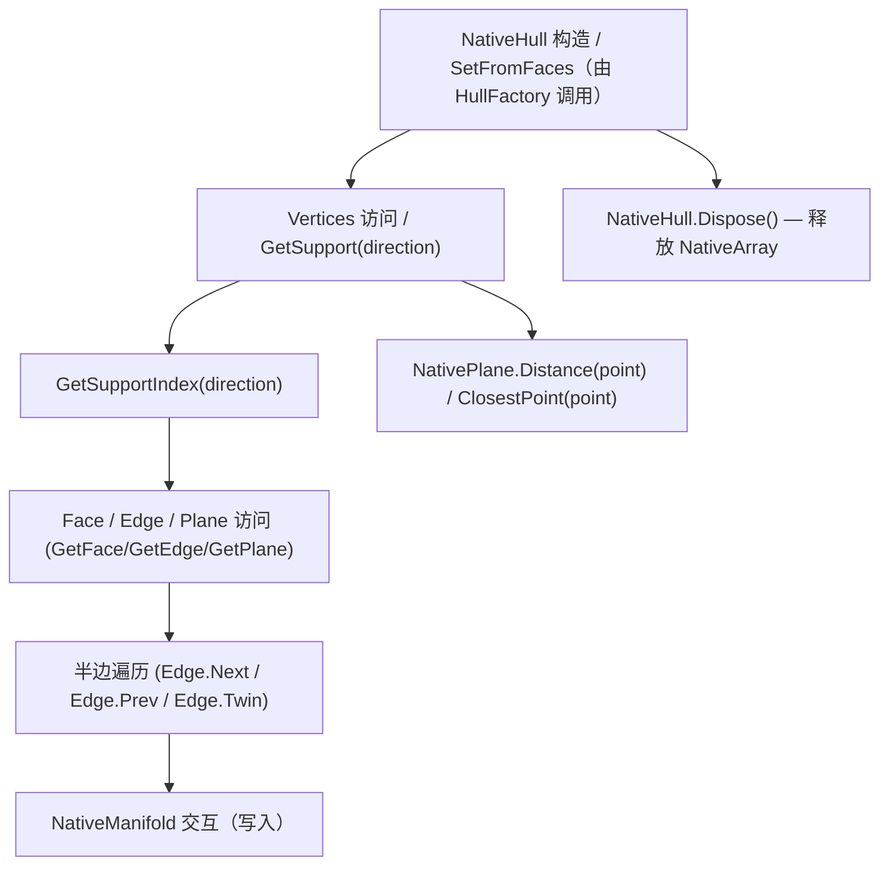

#  NativeHull / NativeFace / NativeHalfEdge / NativePlane（函数与数据结构详解）

> 本笔记讲解 `NativeHull` 及其相关原生数据结构（`NativeFace`、`NativeHalfEdge`、`NativePlane`）的字段、重要方法、内存布局、以及如何在碰撞算法中使用这些接口。
> 适合用于理解半边拓扑、支持点查询、以及如何高效访问/遍历 Hull 数据。

---

## 概览流程图（Mermaid + click）

## NativeHull 构造 与 SetFromFaces

`NativeHull` 的构造通常由 `HullFactory.SetFromFaces` 完成（请参见模块 2）。核心结果是建立以下原生数组并设置指针：

- `VerticesNative` / `hull.Vertices`（顶点数组，NativeArray<float3> / 指针形式）
- `FacesNative` / `hull.Faces`（每个 face 包含 `Edge` 索引等，NativeFace）
- `EdgesNative` / `hull.Edges`（半边数组，NativeHalfEdge）
- `PlanesNative` / `hull.Planes`（每个面的 `NativePlane`）

**构建要点**

- 顶点复制到 `Persistent` 的 `NativeArray`，并保存裸指针供低开销访问；
    
- Faces/Edges/Planes 也以 NativeArray 分配，并尽量避免托管拷贝以减少 GC；
    
- 半边拓扑保证每条边以两条半边存储（e 和 e.Twin）。
## GetSupport

`public float3 GetSupport(float3 direction)`

**功能**

- 返回在给定 `direction` 方向上最远的顶点位置（支持点），用于 SAT 投影和 GJK 等算法。
    

**注意**

- `direction` 无需归一化（但归一化可提高数值稳定性）；实现中常把方向归一化以便优化判断；
    
- 对于大顶点数的 `NativeHull`，`GetSupport` 是热点函数，建议考虑加速策略（见优化部分）。
    
---

## GetSupportIndex

**Heading:** `GetSupportIndex`

**功能**

- 返回最远顶点的索引（比直接返回位置更轻量，便于后续定位或写入 FeaturePair）。
    

**实现提示**

- 与 `GetSupport` 相同的线性扫描，但记录索引 `bestIndex` 而非坐标。
    
- 常在 `Project`/`QueryFaceDistance` 中先获取索引，再读取顶点或构造 `ContactID`。
    

**优势**

- 返回索引后，可以直接将索引写入 `FeaturePair`/`ContactID`，便于回溯与回放。
    

---

## Face / Edge / Plane 访问器

**Heading:** `Face_Edge_Plane_访问器`

**常见访问函数**

- `GetFace(int faceIndex)` → 返回 `NativeFace`（包含 `Edge` 索引、plane 索引等）
    
- `GetEdge(int edgeIndex)` → 返回 `NativeHalfEdge`
    
- `GetPlane(int faceIndex)` → 返回 `NativePlane`
    

**NativeFace

`struct NativeFace {     int Edge;    // 指向该面某条半边的索引     // 可能还有其他字段（质心、顶点计数等） }`

**NativeHalfEdge

`struct NativeHalfEdge {     int Origin;  // 顶点索引（起点）     int Twin;    // 对应的半边索引     int Next;    // 下一个半边索引（同面环）     int Prev;    // 上一个半边索引     int Face;    // 所属面索引 }`

**说明**

- `Edge` 字段通常指向该面上某条半边（任意一条），通过 `.Next` 可顺时针/逆时针遍历整圈；
    
- `Twin` 用于在相邻面间切换边并获取对应对面信息（如构造 FeaturePair 的 In/OutEdge）。
    

---

## Dispose

**Heading:** `Dispose`

**签名（示意）**

`public void Dispose()`

**功能**

- 释放 `NativeArray` / `NativeBuffer` 的底层内存（顶点、面、边、平面数组）。
    
- 在 `HullTester.EnsureDestroyed()` 等清理流程中调用以避免内存泄露。
    

**实现要点**

- 如果 `NativeArray.IsCreated` 则 `Dispose()`；
    
- 置空指针 `Vertices = null`、`Faces = null` 等（防止悬空访问）；
    
- 对于重复调用 `Dispose()` 的安全性（幂等）应当保证，例如先检测 `IsCreated`。
    

---

## NativePlane 运算

**Heading:** `NativePlane_运算`

`NativePlane` 在模块中用于表示面的法线与偏移（plane.Normal, plane.Offset），并提供方法：

- `Distance(float3 point)` — 返回 `dot(Normal, point) - Offset`；
    
- `ClosestPoint(float3 point)` — 最近点（point - Distance * normalize(Normal)）；
    
- `operator*(RigidTransform t, NativePlane p)` — 把平面变换到另一个刚体空间（旋转法线并调整 offset）。
    

**使用场景**

- QueryFaceDistance 中把平面变换到另一个 hull 空间后调用 `Distance(supportPoint)`；
    
- Clip（裁剪）中用 plane.Distance 判断点在内/外。
    

**数值注意**

- `Normal` 要归一化以保证 `Distance` 有意义；
    
- `ClosestPoint` 中 `normalize(Normal)` 要对零长度法线做保护。
    

---

## NativeManifold 交互

**Heading:** `NativeManifold_交互`

`NativeManifold`（详见 Module 7 / NativeManifold.md）用于接触点集合，它与 `NativeHull` 的交互常见场景：

- `HullIntersection` / `HullOperations` 在计算到接触点时写入 `NativeManifold`；
    
- 写入时通常以 `ContactPoint` 包含 `Position`、`Distance`、`Penetration`、`ContactID（FeaturePair）`；
    
- `NativeManifold.MaxPoints` 限制点数（例如 24），调用方需知道并做好合并/降采样策略。
    
