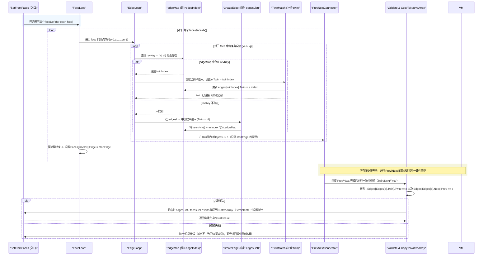

```mermaid
sequenceDiagram
    %% 参与者（别名 as "可读标签"）
    participant SF as "SetFromFaces (入口)"
    participant FL as "FaceLoop"
    participant EL as "EdgeLoop"
    participant EM as "edgeMap (键->edgeIndex)"
    participant CE as "CreateEdge (临时 edgesList)"
    participant TM as "TwinMatch (补全 twin)"
    participant PN as "PrevNextConnector"
    participant VC as "Validate & CopyToNativeArray"

    rect rgb(240,248,255)
    SF->>FL: 开始遍历每个 faceDef (for each face)
    end

    loop 对于 每个 face (faceIdx)
        FL->>EL: 遍历 face 的顶点序列 (v0,v1,...,vn-1)
        loop 对于 face 中每条有向边 (vi -> vj)
            EL->>EM: 查找 revKey = (vj, vi) 是否存在
            alt edgeMap 中存在 revKey
                EM-->>EL: 返回 twinIndex
                EL->>TM: 创建当前半边 e，设置 e.Twin = twinIndex
                TM->>EM: 更新 edges[twinIndex].Twin = e.index
                TM-->>EL: twin 已链接（对称完成）
            else revKey 不存在
                EM-->>EL: 未找到
                EL->>CE: 在 edgesList 中创建半边 e (Twin = -1)
                CE->>EM: 将 key=(vi,vj) -> e.index 写入 edgeMap
            end
            EL->>PN: 在当前面内连接 prev -> e（记录 startEdge 若需要）
        end
        FL->>FL: 面处理结束 -> 设置 Faces[faceIdx].Edge = startEdge
    end

    rect rgb(245,245,220)
    note over PN,VM: 所有面处理完毕，进行 Prev/Next 的最终连接与一致性修正
    end

    PN->>VC: 连接 Prev/Next 完成后执行一致性校验（Twin/Next/Prev）
    VC->>VC: 断言：Edges[Edges[e].Twin].Twin == e 以及 Edges[Edges[e].Next].Prev == e
    alt 校验通过
        VC->>SF: 将临时 edgesList / facesList / verts 拷贝到 NativeArray（Persistent）并设置指针
        SF-->>VC: 返回构建完成的 NativeHull
    else 校验失败
        VC->>SF: 抛出/记录错误（输出不一致的边/面索引），可尝试回滚或重新构建
    end

```

